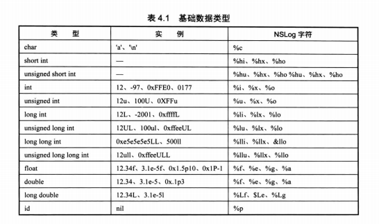
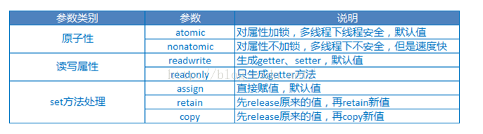

# 格式化输出符号


# property 属性
- atomic (默认)同一个时刻只有一个线程访问, 只能保证get和set的线程安全，无法保证对象的线程安全，性能比nonatomic慢20倍
- nonatomic 允许多线程同时访问
- assign(默认属性) 无需更改引用计数，基础数据类型使用
- retain 指针拷贝和引用计数加-
- copy 内容拷贝，不影响原有对象
- strong (ARC 默认属性), 相当于retain
- weak 相当于assign
- @dynamic 告诉编译器setter和getter方法由用户自己实现
- 基本数据类型：atomic, readwrite, assign; oc 对象: atomic readwrite, strong



# 分类和扩展
- 扩展是一种特殊的分类，扩展没有名字，扩展可以扩展属性，成员变量和方法
- 分类只能扩展方法

# 枚举类型
NS_ENUM 和NS_OPTIONS 指定底层数据类型，NS_OPTIONS 用于位掩码
```
enum Sex {
    Sex_Man,
    Sex_Woman,
};
enum Sex b = Sex_Man;

typedef enum {
    UserSex_Man,
    UserSex_Woman
}UserSex;
UserSex c = UserSex_Man;

typedef NS_ENUM(NSInteger, CYLSex) {
    CYLSexMan,
    CYLSexWoman,
};
 
```
# Foundation和Core Foundation的区别
- Foundation 使用OC实现，Core Foundation 使用C实现
- Foundation 和Core Foundation 对象间的转换: 俗称桥接
- Foundation 类以NS开头, Core Foundation以CF开头

## OC(Foundation)strOC ->C(Core Foundation) strC
- __bridge 没有转移对象所有权，依然由OC管理
- __bridge_retianed 转移对象所有权，strC 必须自己手动释放内存

## C(Core Foundation) strC -> OC(Foudation) strOC
- __bridge 没有转移对象所有权，依然由C管理
- __bridge_transfer 转移对象所有权，由OC管理

# NS_ASSUME_NONNULL_BEGIN 和 NS_ASSUME_NONNULL_END
宏之间的代码，所有简单指针对象被假定为nonnull

# KVO
- 当一个对象的属性被注册观察者时，会生成一个中间类继承自此类，然后将类的isa指针指向新生成的子类，这样被观察的对象就变成这个中间类，
同时重新属性的setter方法，当新对象的属性发生变化时，会依次通知注册的观察者对象
- 键值观察通知依赖于NSObject 的两个方法: willChangeValueForKey: 和 didChangevlueForKey:；在一个被观察属性发生改变之前， willChangeValueForKey: 一定会被调用，这就 会记录旧的值。而当改变发生后，didChangeValueForKey: 会被调用，继而 observeValueForKey:ofObject:change:context: 也会被调用
- KVO 手工触发
```
@property (nonatomic, strong) NSDate *now;
- (void)viewDidLoad
{
    [super viewDidLoad];

    // “手动触发self.now的KVO”，必写。
    [self willChangeValueForKey:@"now"];

    // “手动触发self.now的KVO”，必写。
    [self didChangeValueForKey:@"now"];
}
```
- 使用例子
```
// KVO.h
#import <Foundation/Foundation.h>

NS_ASSUME_NONNULL_BEGIN

@interface ObjectA : NSObject
@property (nonatomic, assign) NSInteger valueA;
@end

@interface ObjectB : NSObject
@property(nonatomic, assign) NSInteger valueB;

-(void) observeValuForKeyPath:(NSString*)keyPath ofObject:(id)object change:(NSDictionary<NSKeyValueChangeKey, id>*)change context:(void*)context;
@end

NS_ASSUME_NONNULL_END


// KVO.m
#import "KVO.h"
@implementation ObjectA

@end

@implementation ObjectB

-(void) observeValueForKeyPath:(NSString*)keyPath ofObject:(id)object change:(NSDictionary<NSKeyValueChangeKey, id>*)change context:(void*)context {
    if (![object isKindOfClass:[ObjectA class]]) {
        return ;
    }
    
    if (![keyPath isEqualToString:@"valueA"]) {
        return ;
    }
    
    NSLog(@"ObjectA valueA changed %@", change);
}

@end

// test function
void TestKVO() {
    ObjectA* objA = [[ObjectA alloc] init];
    ObjectB* objB = [[ObjectB alloc] init];
    [objA addObserver:objB forKeyPath:@"valueA" options:NSKeyValueObservingOptionNew context:nil];
    objA.valueA = 10;
    //[objA removeObserver:objB forKeyPath:@"valueA"];
}
```

# +(void)load
- load 方法在main函数之前调用
- 类被import时初始加载时调用，顺序依次是父类优于子类，子类优于分类
- 主要用来进行method swizzle
- 子类没有load，则不会调用父类

# +(void)initialize
- initialize 方法在main函数之后调用
- 第一次调用类方法时加载，属于懒加载
- 主要用来初始化全局变量和静态变量
- 子类没有initialize 方法也会调用父类的方法

# SEL 就是C语言的指针函数