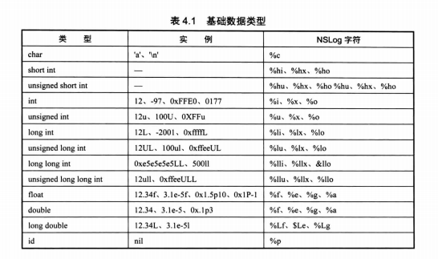

# 基础数据类型

# 格式化输出符号


# 枚举类型
NS_ENUM 和NS_OPTIONS 指定底层数据类型，NS_OPTIONS 用于位掩码
```
enum Sex {
    Sex_Man,
    Sex_Woman,
};
enum Sex b = Sex_Man;

typedef enum {
    UserSex_Man,
    UserSex_Woman
}UserSex;
UserSex c = UserSex_Man;

typedef NS_ENUM(NSInteger, CYLSex) {
    CYLSexMan,
    CYLSexWoman,
};
 

