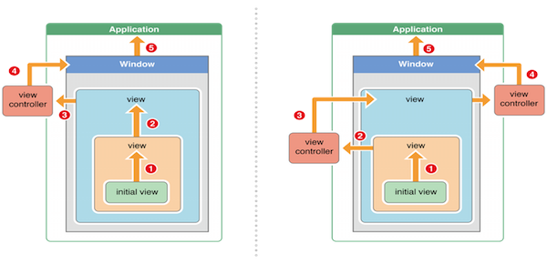

# Size classes
对屏幕进行分类

# UIView和CALayer的关系
- UIView是一个CALayer的管理器
- UIView 可以返回主CALayer实例
- UIView layerClass 可以返回主layer所使用的类
- UIView的CALayer是一个树形结构， 可以添加子layer
- UIView的layer树形结构在系统内部维护了三份copy
  - 逻辑树，就是代码里可以操纵的，例如更改layer的属性等等就在这一份
  - 动画树，这是一个中间层，系统正是在这一层上更改属性，进行各种渲染操作
  - 显示树，这棵树的内容是当前正被显示在屏幕上的内容
  
# 沙盒目录结构
- Application: 存放程序源文件，上架前经过数字签名，上架后不可修改
- Documents: 常用目录，iCloud备份目录，存放数据
- Library: 
  - Caches: 存放体积大又不需要备份的数据
  - Preference: 设置目录，iCloud会备份设置信息
- tmp: 存放铃声文件，不会被备份，而且这个文件下的数据有可能随时被清除

# pushViewController 和presentViewController 的区别
- presentViewController 提供一个模态视图控制器
- pushViewController 提供一个栈控制数组

# SDWebImage 里面UIImageView加载图片的逻辑
- url 为key查找缓存->磁盘
- 下载图片加入缓存并写入磁盘

# 触摸事件的传递
- 从父控件传递到子控件
- 不能接受触摸事件的四种情况
  - 不接收用户交互，即：userInteractionEnabled = NO
  - 隐藏，即：hidden = YES
  - 透明，即：alpha <= 0.01
  - 未启用，即：enabled = NO

# 事件响应者链
UIView->UIWindow->UIApplication
如何判断上一个响应者
- 如果当前这个view是控制器的view，那么控制器就是上一个响应者
- 如果当前这个view不是控制器的view，那么父控件就是上一个响应者

